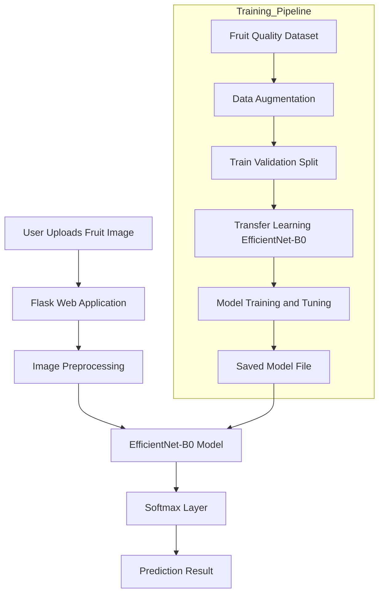
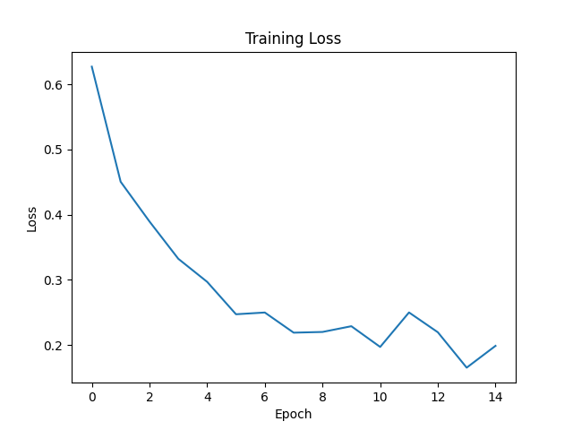
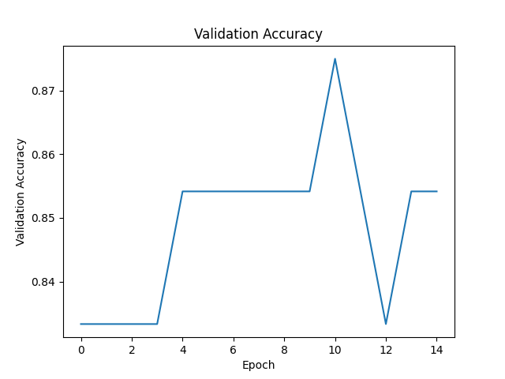
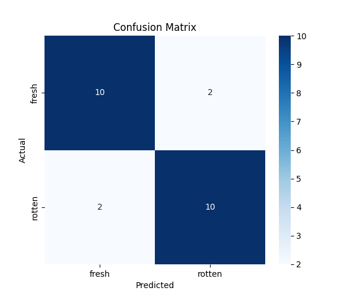

# 🍎 Fruit Quality Detection using Deep Learning

##  Problem Description

Fruit quality inspection is critical for food safety, supply chain efficiency, and consumer satisfaction. Manual inspection is time-consuming, subjective, and prone to human error, especially in large-scale agricultural and food processing environments.

This project implements an **end-to-end deep learning system** that automatically classifies fruit images as **Fresh** or **Rotten** using a **Convolutional Neural Network (CNN)** with **transfer learning**.

Through a web interface, users can upload a fruit image and instantly receive:
- Predicted quality (Fresh or Rotten)
- Confidence score of the prediction

###  Target Users
- Farmers and agricultural producers  
- Food processing companies  
- Quality control inspectors  
- Grocery stores and supermarkets  

---

##  Dataset

### Fruit Quality Dataset (Fresh vs Rotten)

The dataset consists of labeled fruit images grouped into two classes:
- **Fresh** – Fruits without visible spoilage or defects
- **Rotten** – Fruits showing decay, mold, or damage

 **Dataset Link (Kaggle):**  
https://www.kaggle.com/datasets/nourabdoun/fruits-quality-fresh-vs-rotten

### Dataset Structure
```text
data/
├── train/
│   ├── fresh/
│   └── rotten/
├── val/
│   ├── fresh/
│   └── rotten/
└── test/
    ├── fresh/
    └── rotten/
```

##  Demo Video
Watch the project demonstration:  
https://drive.google.com/file/d/1ey2m5nNyAH8HY7dMw34l3z0xJz7NjPfZ/view?usp=drive_link

---
##  System Architecture

The system follows an end-to-end machine learning workflow, from data ingestion and model training to deployment and real-time inference.


---

##  Model Architecture

### EfficientNet-B0 with Transfer Learning
- **Backbone:** EfficientNet-B0 pretrained on ImageNet
- **Transfer Learning:** Feature layers frozen, only classifier retrained
- **Input Size:** 224×224 RGB images
- **Output:** Binary classification (Fresh vs Rotten)
- **Classes:** 2 (Fresh, Rotten)

### Data Augmentation
- Random horizontal flips
- Random rotations (±10 degrees)
- Image normalization using ImageNet statistics

### Training Strategy
- **Loss Function:** Cross-Entropy Loss
- **Optimizer:** Adam (Learning Rate = 0.001)
- **Batch Size:** 16
- **Epochs:** 15
- **Device:** GPU-accelerated training with CUDA support

---

##  Model Performance

### Training Metrics
#### Training Loss over Epochs


#### Validation Accuracy over Epochs


### Evaluation Metrics
#### Confusion Matrix


---

## Code Structure

### Key Files
- **`train.py`** - Model training script with data loading, training loop, and evaluation
- **`predict.py`** - Flask web application for real-time predictions
- **`Dockerfile`** - Container configuration for deployment
- **`k8s/`** - Kubernetes deployment configurations
- **`requirements.txt`** - Python dependencies

### Training Process
```
bash
# Run training script
python train.py
```

The script automatically:

1. Loads and preprocesses the dataset
2. Initializes EfficientNet-B0 with transfer learning
3. Trains the model for 15 epochs
4. Saves the model to `models/fruit_quality_model.pth`
5. Generates performance visualizations in `outputs/` directory

---

##  Web Application

### Features
- **User-friendly interface** for image upload
- **Real-time predictions** with confidence scores
- **Image preview** before and after upload
- **Responsive design** for mobile and desktop
- **Health check endpoint** for monitoring

### Tech Stack
- **Backend:** Flask (Python)
- **Frontend:** HTML/CSS with Bootstrap
- **Deep Learning:** PyTorch with EfficientNet-B0
- **Image Processing:** PIL/Pillow

### API Endpoints
- `GET /` - Main application interface
- `POST /` - Image upload and prediction
- `GET /health` - Health check endpoint (returns JSON)

---

##  Containerization

### Docker Configuration
```dockerfile
FROM python:3.10-slim
WORKDIR /app
COPY requirements.txt .
RUN pip install --no-cache-dir -r requirements.txt
COPY . .
RUN mkdir -p static/uploads
EXPOSE 5000
CMD ["python", "predict.py"]
```
### Build & Run
```bash
docker build -t fruit-quality-app .
docker run -p 5000:5000 fruit-quality-app
```

##  Kubernetes Deployment

### Kubernetes Configuration Files

#### 1. Deployment (`k8s/deployment.yaml`)
```yaml
apiVersion: apps/v1
kind: Deployment
metadata:
  name: fruit-quality-deployment
spec:
  replicas: 1
  selector:
    matchLabels:
      app: fruit-quality
  template:
    metadata:
      labels:
        app: fruit-quality
    spec:
      containers:
      - name: fruit-quality
        image: fruit-quality-app
        ports:
        - containerPort: 5000
```
#### 2.  Service (k8s/service.yaml)
```yaml
apiVersion: v1
kind: Service
metadata:
  name: fruit-quality-service
spec:
  type: NodePort
  selector:
    app: fruit-quality
  ports:
  - port: 80
    targetPort: 5000
    nodePort: 30007
```

##  Deploy to Kubernetes Cluster
```bash
# Apply Kubernetes configurations
kubectl apply -f k8s/deployment.yaml
kubectl apply -f k8s/service.yaml
```

### Check deployment status
```bash
kubectl get deployments
kubectl get pods
kubectl get services
```


### Deployment Options
Local Minikube Cluster (for development)

Cloud Kubernetes Services (AWS EKS, Google GKE, Azure AKS)

Hybrid Deployment (On-premise + Cloud)

